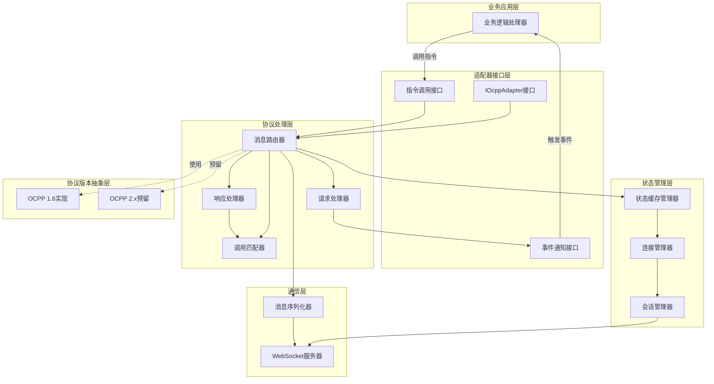
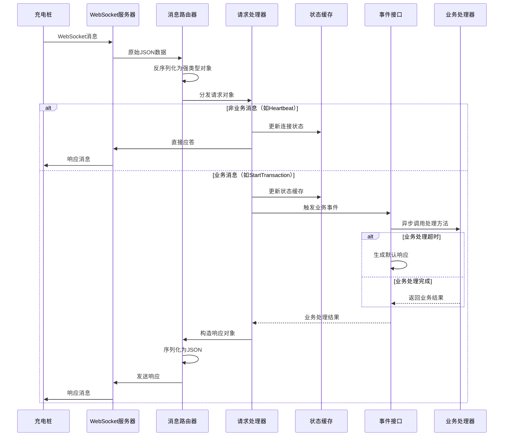
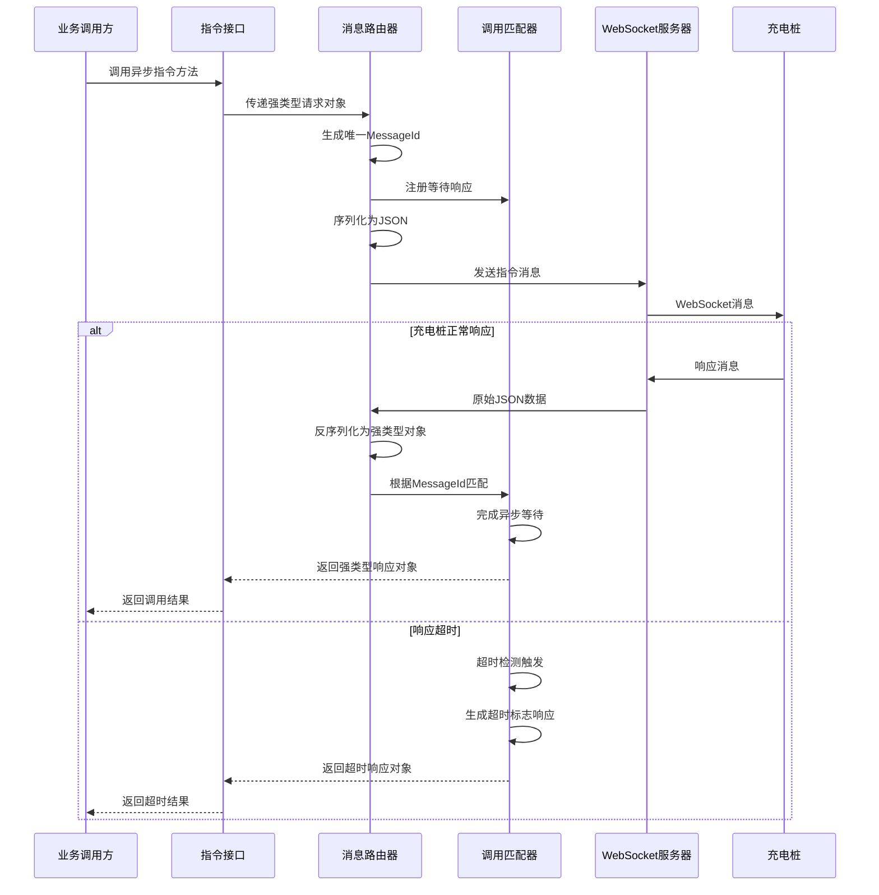
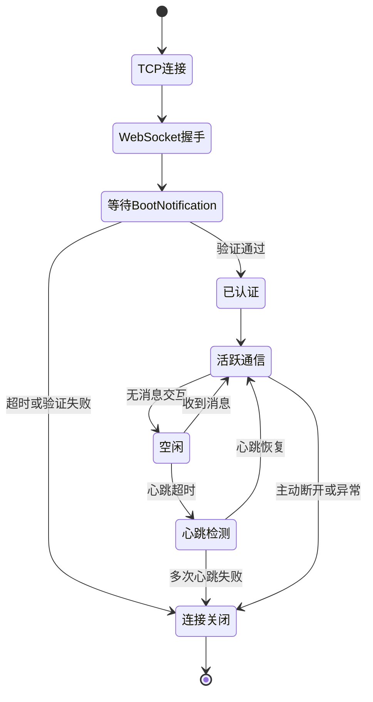
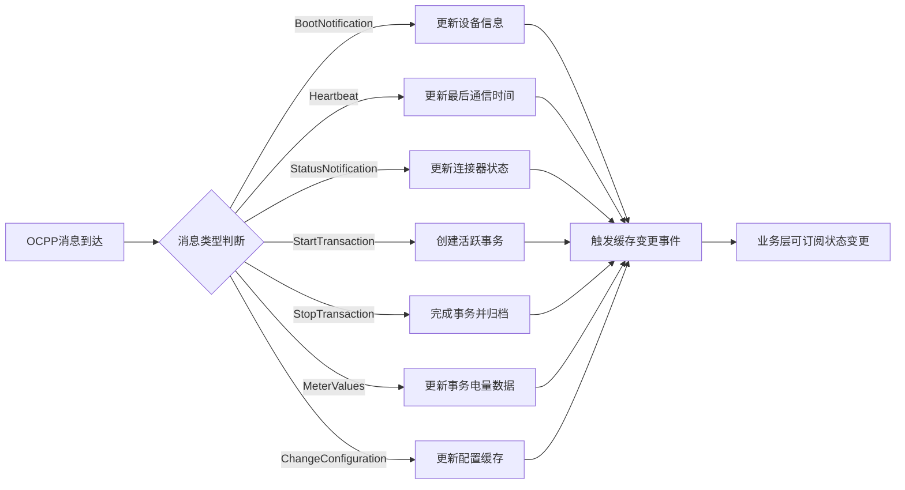
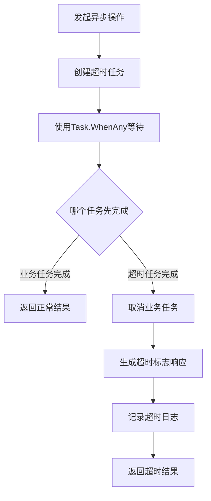
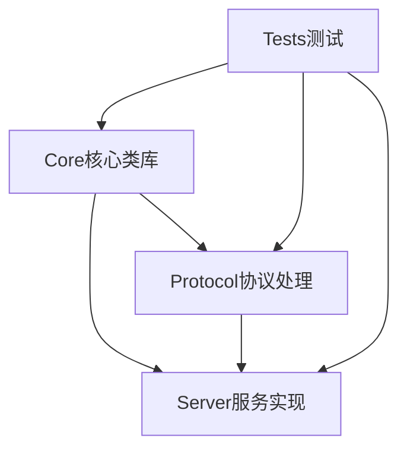

# OCPP协议接入适配器设计文档

## 1. 项目概述

### 1.1 项目背景
为充电站管理系统（CSMS）开发一个高性能的OCPP协议接入适配器，作为充电桩与业务系统之间的协议转换层和连接管理层。该适配器需要处理底层OCPP协议通信细节，向上层业务系统提供面向对象的强类型编程接口。

### 1.2 核心目标
- 实现完整的OCPP 1.6协议支持，符合协议规范要求
- 提供高性能、高并发的WebSocket连接管理能力
- 自主处理设备接入、连接保持、心跳及非业务消息
- 维护充电桩实时状态缓存，提供快速查询能力
- 向业务层提供异步、强类型的面向对象接口
- 支持协议版本扩展，为未来OCPP 2.x预留架构空间

### 1.3 技术选型
- 框架版本：.NET 9
- 项目类型：类库项目（供CSMS主系统集成）
- 通信协议：OCPP-J 1.6（基于WebSocket的JSON格式）
- 编程范式：面向对象、异步编程、事件驱动

## 2. 系统架构设计

### 2.1 架构分层



### 2.2 核心组件职责

| 组件名称 | 主要职责 | 关键能力 |
|---------|---------|---------|
| WebSocket服务器 | 管理TCP连接、WebSocket握手、数据帧收发 | 支持大量并发连接、异步IO |
| 消息序列化器 | JSON消息与强类型对象互转、消息格式校验 | 基于JSON Schema验证、类型安全 |
| 会话管理器 | 维护单个充电桩的通信会话、心跳检测 | 连接状态跟踪、超时检测 |
| 连接管理器 | 管理所有充电桩连接池、身份认证 | 连接索引、快速查找 |
| 状态缓存管理器 | 维护充电桩实时状态、配置信息、事务状态 | 内存缓存、状态同步、查询接口 |
| 调用匹配器 | 匹配请求与响应、管理等待响应的异步操作 | 基于MessageId的请求-响应配对、超时处理 |
| 消息路由器 | 根据消息类型分发到对应处理器 | 支持充电桩上报和系统下发双向消息 |
| 请求处理器 | 处理充电桩上报的请求消息 | 自动应答非业务消息、触发业务事件 |
| 响应处理器 | 处理充电桩对系统指令的响应 | 完成异步等待、返回强类型结果 |
| 事件通知接口 | 向业务层发布充电桩业务事件 | 异步事件、超时控制 |
| 指令调用接口 | 接受业务层调用、下发指令到充电桩 | 异步方法、强类型参数和返回值 |

### 2.3 消息流转设计

#### 2.3.1 充电桩上报业务消息流程



#### 2.3.2 系统主动下发指令流程



## 3. 连接与会话管理

### 3.1 连接生命周期管理

#### 3.1.1 连接建立流程



#### 3.1.2 连接管理策略

| 管理维度 | 策略描述 | 配置参数 |
|---------|---------|---------|
| 身份识别 | 基于BootNotification中的充电桩标识符建立连接映射 | 充电桩唯一ID（ChargePointId） |
| 重复连接 | 同一充电桩新连接建立时，主动关闭旧连接 | 允许连接抢占 |
| 心跳检测 | 基于Heartbeat消息的双向心跳机制 | 心跳间隔、容忍次数 |
| 超时处理 | 等待BootNotification超时时间 | 默认60秒 |
| 连接池 | 使用并发字典管理所有活跃连接 | 无连接数限制 |
| 断线重连 | 充电桩负责重连，适配器接受新连接并恢复状态 | 保留历史状态一定时间 |

### 3.2 会话状态维护

#### 3.2.1 会话核心数据

| 数据类型 | 数据项 | 用途 |
|---------|-------|------|
| 连接信息 | 充电桩ID、WebSocket连接对象、连接时间、最后通信时间 | 连接管理与路由 |
| 设备信息 | 厂商、型号、序列号、固件版本、ICCID、IMSI | 设备识别与管理 |
| 协议版本 | OCPP协议版本号 | 协议版本适配 |
| 认证状态 | 已认证、待认证 | 访问控制 |
| 心跳状态 | 最后心跳时间、连续失败次数 | 连接健康检测 |
| 待响应队列 | 已发送待响应的Call消息集合 | 响应匹配与超时管理 |

#### 3.2.2 会话数据存储策略

- 所有会话数据存储在内存中，确保高性能访问
- 使用线程安全的并发集合存储
- 连接断开后保留会话数据一定时间（可配置，默认10分钟），以支持快速重连
- 提供会话数据持久化接口，由外部系统决定是否需要持久化

## 4. 状态缓存设计

### 4.1 缓存数据模型

#### 4.1.1 充电桩状态缓存结构

| 状态类别 | 包含数据 | 更新来源 | 查询场景 |
|---------|---------|---------|---------|
| 设备基础信息 | 充电桩ID、厂商、型号、序列号、固件版本 | BootNotification | 设备管理、监控展示 |
| 连接状态 | 在线/离线、连接时间、最后通信时间 | 连接事件、Heartbeat | 实时监控 |
| 充电点配置 | 配置项键值对集合 | GetConfiguration、ChangeConfiguration | 配置管理 |
| 连接器状态 | 连接器数量、各连接器可用性、状态、错误码 | StatusNotification | 实时监控、业务调度 |
| 活跃事务 | 事务ID、连接器ID、开始时间、卡号、电量 | StartTransaction、StopTransaction、MeterValues | 充电业务处理 |
| 预约信息 | 预约ID、连接器ID、卡号、有效期 | ReserveNow、CancelReservation | 预约管理 |
| 本地授权列表版本 | 版本号 | GetLocalListVersion、SendLocalList | 授权管理 |
| 诊断状态 | 诊断状态、上传状态 | DiagnosticsStatusNotification | 运维管理 |
| 固件状态 | 固件升级状态 | FirmwareStatusNotification | 运维管理 |

#### 4.1.2 状态缓存更新机制



### 4.2 缓存查询接口

#### 4.2.1 查询方法设计

| 查询方法 | 输入参数 | 返回类型 | 用途 |
|---------|---------|---------|------|
| GetChargePointInfo | 充电桩ID | 充电桩信息对象（可空） | 获取设备基础信息 |
| GetChargePointStatus | 充电桩ID | 充电桩状态对象（可空） | 获取在线状态、连接器状态 |
| GetConnectorStatus | 充电桩ID、连接器ID | 连接器状态对象（可空） | 获取单个连接器状态 |
| GetActiveTransaction | 充电桩ID、连接器ID | 事务对象（可空） | 获取活跃充电事务 |
| GetAllActiveTransactions | 充电桩ID | 事务对象集合 | 获取充电桩所有活跃事务 |
| GetReservation | 充电桩ID、连接器ID | 预约对象（可空） | 获取连接器预约信息 |
| IsChargePointOnline | 充电桩ID | 布尔值 | 快速判断在线状态 |
| GetAllConnectedChargePoints | 无 | 充电桩ID列表 | 获取所有在线充电桩 |

#### 4.2.2 缓存一致性保证

- 所有状态更新在消息处理线程中同步完成，确保消息顺序性
- 使用读写锁保护缓存数据，支持并发读取、独占写入
- 充电桩断线后保留状态快照，标记为离线，不立即清除
- 提供缓存手动刷新接口，用于异常情况的状态修正

## 5. 消息处理机制

### 5.1 OCPP消息类型与处理策略

#### 5.1.1 消息分类

根据OCPP 1.6协议，消息分为三类：

| 消息类型 | 描述 | 格式标识 | 处理职责 |
|---------|------|---------|---------|
| Call | 请求消息（发起调用） | \[2, MessageId, Action, Payload\] | 充电桩上报或系统下发 |
| CallResult | 成功响应消息 | \[3, MessageId, Payload\] | 对Call的成功应答 |
| CallError | 错误响应消息 | \[4, MessageId, ErrorCode, ErrorDescription, ErrorDetails\] | 对Call的错误应答 |

#### 5.1.2 消息方向与处理策略

| 消息方向 | 消息示例 | 处理策略 | 超时机制 |
|---------|---------|---------|---------|
| 充电桩→适配器（非业务） | Heartbeat、BootNotification、StatusNotification、MeterValues | 适配器自动处理并应答，更新状态缓存 | 无需超时控制 |
| 充电桩→适配器（业务） | StartTransaction、StopTransaction、Authorize | 触发业务事件，等待业务处理结果后应答 | 事件处理超时（可配置，默认30秒） |
| 适配器→充电桩（指令） | RemoteStartTransaction、RemoteStopTransaction、Reset、ChangeConfiguration、GetConfiguration、UnlockConnector等 | 业务层调用指令接口，等待充电桩响应 | 指令响应超时（可配置，默认60秒） |

### 5.2 自动处理的非业务消息

#### 5.2.1 BootNotification处理

- 目的：充电桩上线注册，建立会话
- 自动处理内容：
  - 验证充电桩身份（可选，通过配置启用）
  - 创建或更新会话信息
  - 缓存设备基础信息
  - 返回Accepted状态及心跳间隔配置
- 可配置项：心跳间隔时间、是否启用身份验证
- 事件通知：充电桩上线事件（可选订阅）

#### 5.2.2 Heartbeat处理

- 目的：保持连接活跃，检测连接健康
- 自动处理内容：
  - 更新最后通信时间
  - 重置心跳超时计数器
  - 返回当前服务器时间
- 无需业务层介入

#### 5.2.3 StatusNotification处理

- 目的：充电桩上报连接器状态变化
- 自动处理内容：
  - 更新连接器状态缓存（状态、错误码、时间戳）
  - 返回空应答
- 事件通知：连接器状态变更事件（可选订阅）
- 业务层用途：监控展示、故障告警

#### 5.2.4 MeterValues处理

- 目的：充电桩上报电表采样数据
- 自动处理内容：
  - 更新事务的最新电量数据
  - 缓存采样值序列（可配置保留数量）
  - 返回空应答
- 事件通知：电表数据上报事件（可选订阅）
- 业务层用途：实时监控、计费数据采集

#### 5.2.5 DiagnosticsStatusNotification处理

- 目的：上报诊断文件上传状态
- 自动处理内容：
  - 更新诊断状态缓存
  - 返回空应答
- 事件通知：诊断状态变更事件（可选订阅）

#### 5.2.6 FirmwareStatusNotification处理

- 目的：上报固件升级状态
- 自动处理内容：
  - 更新固件状态缓存
  - 返回空应答
- 事件通知：固件状态变更事件（可选订阅）

### 5.3 需要业务处理的消息

#### 5.3.1 StartTransaction处理

- 业务含义：充电事务开始
- 适配器处理：
  - 提取事务信息（连接器ID、卡号、起始电量、时间戳）
  - 触发StartTransaction事件，传递强类型事务对象
  - 等待业务层返回授权结果和事务ID
  - 超时则返回默认拒绝响应
  - 创建活跃事务缓存
  - 返回响应给充电桩
- 业务层职责：
  - 验证卡号授权
  - 分配事务ID
  - 返回授权状态和事务ID

#### 5.3.2 StopTransaction处理

- 业务含义：充电事务结束
- 适配器处理：
  - 提取事务结束信息（事务ID、结束电量、时间戳、停止原因）
  - 触发StopTransaction事件，传递强类型事务对象
  - 等待业务层返回处理结果（可包含IdTagInfo）
  - 超时则返回默认成功响应
  - 从活跃事务缓存移除，可选归档到历史记录
  - 返回响应给充电桩
- 业务层职责：
  - 计费处理
  - 订单结算
  - 返回处理结果

#### 5.3.3 Authorize处理

- 业务含义：请求授权鉴权（用户刷卡）
- 适配器处理：
  - 提取卡号信息
  - 触发Authorize事件
  - 等待业务层返回授权结果
  - 超时则返回默认拒绝响应
  - 返回IdTagInfo给充电桩
- 业务层职责：
  - 卡号有效性验证
  - 用户账户检查
  - 返回授权状态

#### 5.3.4 DataTransfer处理

- 业务含义：自定义数据传输
- 适配器处理：
  - 提取VendorId、MessageId和自定义数据
  - 触发DataTransfer事件
  - 等待业务层返回自定义响应数据
  - 超时则返回未知状态
  - 返回响应给充电桩
- 业务层职责：
  - 根据VendorId和MessageId处理自定义协议
  - 返回自定义数据

### 5.4 系统主动下发指令

#### 5.4.1 远程启动充电（RemoteStartTransaction）

- 调用接口：异步方法，传入充电桩ID、连接器ID（可选）、卡号、充电配置（可选）
- 返回值：强类型响应对象，包含接受/拒绝状态
- 超时处理：超时则返回标记超时的响应对象
- 适配器职责：
  - 检查充电桩在线状态
  - 构造RemoteStartTransaction请求报文
  - 发送并等待充电桩响应
  - 返回响应状态

#### 5.4.2 远程停止充电（RemoteStopTransaction）

- 调用接口：异步方法，传入充电桩ID、事务ID
- 返回值：强类型响应对象，包含接受/拒绝状态
- 超时处理：超时则返回标记超时的响应对象

#### 5.4.3 配置管理（GetConfiguration、ChangeConfiguration）

- 调用接口：
  - GetConfiguration：传入充电桩ID、配置项列表（可选，空则获取全部）
  - ChangeConfiguration：传入充电桩ID、配置项键、配置值
- 返回值：
  - GetConfiguration：配置项列表及未知配置项列表
  - ChangeConfiguration：配置结果状态（Accepted/Rejected/RebootRequired/NotSupported）
- 自动缓存更新：成功修改配置后自动更新本地配置缓存

#### 5.4.4 重置指令（Reset）

- 调用接口：异步方法，传入充电桩ID、重置类型（Soft/Hard）
- 返回值：接受/拒绝状态
- 注意事项：重置会导致连接断开，适配器需处理重连

#### 5.4.5 解锁连接器（UnlockConnector）

- 调用接口：异步方法，传入充电桩ID、连接器ID
- 返回值：解锁结果（Unlocked/UnlockFailed/NotSupported）

#### 5.4.6 充电配置管理（SetChargingProfile、ClearChargingProfile、GetCompositeSchedule）

- SetChargingProfile：设置充电功率曲线
- ClearChargingProfile：清除充电配置
- GetCompositeSchedule：获取合成的充电计划
- 所有接口均为异步方法，传入强类型参数对象，返回强类型响应对象

#### 5.4.7 预约管理（ReserveNow、CancelReservation）

- ReserveNow：预约连接器
- CancelReservation：取消预约
- 自动缓存更新：成功预约后更新预约缓存

#### 5.4.8 本地授权列表管理（SendLocalList、GetLocalListVersion）

- SendLocalList：下发本地授权列表
- GetLocalListVersion：获取列表版本号
- 自动缓存更新：成功更新列表后更新版本号缓存

#### 5.4.9 固件升级（UpdateFirmware）

- 调用接口：异步方法，传入充电桩ID、固件下载地址、下载时间、重试次数等
- 返回值：空响应（充电桩通过FirmwareStatusNotification异步上报进度）

#### 5.4.10 诊断文件获取（GetDiagnostics）

- 调用接口：异步方法，传入充电桩ID、上传地址、时间范围、重试次数等
- 返回值：文件名或空（充电桩通过DiagnosticsStatusNotification异步上报进度）

#### 5.4.11 触发消息（TriggerMessage）

- 调用接口：异步方法，传入充电桩ID、消息类型、连接器ID（可选）
- 返回值：接受/拒绝/未支持状态
- 用途：主动触发充电桩上报特定消息（如StatusNotification、MeterValues）

#### 5.4.12 清除缓存（ClearCache）

- 调用接口：异步方法，传入充电桩ID
- 返回值：接受/拒绝状态
- 用途：清除充电桩本地授权缓存

## 6. 强类型对象模型设计

### 6.1 消息对象类型体系

#### 6.1.1 基础类型定义

所有OCPP消息对象继承自统一的基类，便于统一处理：

| 基类/接口 | 职责 | 关键属性/方法 |
|----------|------|-------------|
| IOcppMessage | 所有消息的顶层接口 | MessageType（Call/CallResult/CallError）、MessageId |
| OcppRequest | 所有请求消息的基类 | Action（消息动作名称） |
| OcppResponse | 所有响应消息的基类 | 无额外属性 |
| OcppError | 错误响应 | ErrorCode、ErrorDescription、ErrorDetails |

#### 6.1.2 请求与响应对象映射

每个OCPP消息都有对应的强类型请求和响应对象：

| 消息名称 | 请求类型 | 响应类型 | 关键属性 |
|---------|---------|---------|---------|
| BootNotification | BootNotificationRequest | BootNotificationResponse | 请求：ChargePointVendor、ChargePointModel、ChargePointSerialNumber等<br>响应：Status、CurrentTime、Interval |
| Heartbeat | HeartbeatRequest | HeartbeatResponse | 请求：无<br>响应：CurrentTime |
| StatusNotification | StatusNotificationRequest | StatusNotificationResponse | 请求：ConnectorId、Status、ErrorCode、Timestamp<br>响应：无 |
| StartTransaction | StartTransactionRequest | StartTransactionResponse | 请求：ConnectorId、IdTag、MeterStart、Timestamp<br>响应：TransactionId、IdTagInfo |
| StopTransaction | StopTransactionRequest | StopTransactionResponse | 请求：TransactionId、MeterStop、Timestamp、Reason<br>响应：IdTagInfo（可选） |
| Authorize | AuthorizeRequest | AuthorizeResponse | 请求：IdTag<br>响应：IdTagInfo |
| MeterValues | MeterValuesRequest | MeterValuesResponse | 请求：ConnectorId、TransactionId（可选）、MeterValue列表<br>响应：无 |
| RemoteStartTransaction | RemoteStartTransactionRequest | RemoteStartTransactionResponse | 请求：IdTag、ConnectorId（可选）、ChargingProfile（可选）<br>响应：Status |
| RemoteStopTransaction | RemoteStopTransactionRequest | RemoteStopTransactionResponse | 请求：TransactionId<br>响应：Status |
| GetConfiguration | GetConfigurationRequest | GetConfigurationResponse | 请求：Key列表（可选）<br>响应：ConfigurationKey列表、UnknownKey列表 |
| ChangeConfiguration | ChangeConfigurationRequest | ChangeConfigurationResponse | 请求：Key、Value<br>响应：Status |

（其他消息类型类似定义，共计约30个请求-响应对）

#### 6.1.3 复合类型对象

OCPP协议中的复合数据结构也需要强类型定义：

| 复合类型 | 用途 | 关键属性 |
|---------|------|---------|
| IdTagInfo | 授权信息 | Status（授权状态）、ExpiryDate、ParentIdTag |
| ChargingProfile | 充电配置 | ChargingProfileId、StackLevel、ChargingProfilePurpose、ChargingProfileKind、ChargingSchedule |
| ChargingSchedule | 充电计划 | Duration、StartSchedule、ChargingRateUnit、ChargingSchedulePeriod列表 |
| ChargingSchedulePeriod | 计划时段 | StartPeriod、Limit、NumberPhases |
| MeterValue | 电表采样值 | Timestamp、SampledValue列表 |
| SampledValue | 采样数据点 | Value、Context、Format、Measurand、Phase、Location、Unit |
| KeyValue | 配置项 | Key、Readonly、Value |
| AuthorizationData | 授权数据 | IdTag、IdTagInfo |

#### 6.1.4 枚举类型定义

协议中的枚举值使用C#强类型枚举：

| 枚举类型 | 枚举值示例 |
|---------|-----------|
| ChargePointStatus | Available、Preparing、Charging、SuspendedEVSE、SuspendedEV、Finishing、Reserved、Unavailable、Faulted |
| ChargePointErrorCode | ConnectorLockFailure、EVCommunicationError、GroundFailure、HighTemperature、InternalError、LocalListConflict、NoError等 |
| RegistrationStatus | Accepted、Pending、Rejected |
| AuthorizationStatus | Accepted、Blocked、Expired、Invalid、ConcurrentTx |
| RemoteStartStopStatus | Accepted、Rejected |
| ConfigurationStatus | Accepted、Rejected、RebootRequired、NotSupported |
| ResetType | Hard、Soft |
| UnlockStatus | Unlocked、UnlockFailed、NotSupported |
| ChargingProfilePurpose | ChargePointMaxProfile、TxDefaultProfile、TxProfile |
| ChargingProfileKind | Absolute、Recurring、Relative |
| ChargingRateUnit | W（瓦特）、A（安培） |
| Reason | EmergencyStop、EVDisconnected、HardReset、Local、Other、PowerLoss、Reboot、Remote、SoftReset、UnlockCommand、DeAuthorized |

### 6.2 对象序列化与验证

#### 6.2.1 JSON序列化规则

- 使用System.Text.Json进行序列化和反序列化
- 属性命名采用camelCase（与OCPP JSON格式一致）
- 可空属性在序列化时省略null值
- 日期时间格式使用ISO 8601标准（符合OCPP要求）
- 所有对象支持往返序列化验证

#### 6.2.2 消息验证策略

- 基于OCPP官方JSON Schema进行消息格式验证
- 反序列化后进行强类型对象属性验证
- 必填字段缺失时返回OCPP协议错误（FormationViolation）
- 字段类型不匹配时返回协议错误（PropertyConstraintViolation）
- 字段长度超限时返回协议错误（OccurrenceConstraintViolation）
- 验证失败时自动生成CallError响应

## 7. 异步编程与超时控制

### 7.1 异步编程模型

#### 7.1.1 异步方法设计原则

- 所有可能发生IO等待的操作均使用异步方法
- 事件处理器签名为异步委托
- 指令调用接口返回Task或Task<T>
- 使用CancellationToken支持取消操作
- 避免阻塞线程，充分利用异步IO

#### 7.1.2 核心异步场景

| 异步场景 | 异步方法 | 等待对象 |
|---------|---------|---------|
| 接收WebSocket消息 | ReceiveAsync | WebSocket数据帧 |
| 发送WebSocket消息 | SendAsync | 发送完成 |
| 等待充电桩响应 | SendRequestAsync<TRequest, TResponse> | 充电桩CallResult或CallError |
| 业务事件处理 | 事件处理器委托 | 业务处理结果 |
| 超时控制 | Task.WhenAny与Task.Delay组合 | 业务完成或超时 |

### 7.2 超时控制机制

#### 7.2.1 超时配置参数

| 超时类型 | 默认值 | 配置项名称 | 说明 |
|---------|-------|-----------|------|
| BootNotification等待超时 | 60秒 | BootNotificationTimeout | 新连接建立后等待BootNotification的最长时间 |
| 业务事件处理超时 | 30秒 | BusinessEventTimeout | 业务层处理StartTransaction、StopTransaction等事件的最长时间 |
| 指令响应超时 | 60秒 | CommandResponseTimeout | 下发指令后等待充电桩响应的最长时间 |
| 心跳超时 | 可配置 | 基于BootNotificationResponse中的Interval动态计算 | 心跳间隔的2-3倍 |
| 消息发送超时 | 10秒 | MessageSendTimeout | WebSocket消息发送的最长时间 |

#### 7.2.2 超时处理流程



#### 7.2.3 超时响应对象

- 所有响应对象包含IsTimeout属性，标识是否超时
- 超时时自动填充默认值：
  - StartTransaction超时：返回Rejected状态
  - StopTransaction超时：返回Accepted状态
  - Authorize超时：返回Invalid状态
  - 指令超时：根据指令类型返回Rejected或空响应
- 超时事件可通过日志或事件接口向外通知

### 7.3 并发控制

#### 7.3.1 并发处理能力

- 每个充电桩的消息在独立的异步上下文中处理，充电桩之间完全并行
- 同一充电桩的消息按到达顺序串行处理，保证消息顺序性
- 业务事件处理在独立线程池中异步执行，不阻塞消息接收
- 状态缓存使用并发安全集合，支持高并发读写

#### 7.3.2 背压控制

- WebSocket接收缓冲区大小可配置
- 消息处理队列长度限制，防止内存溢出
- 超过队列长度时拒绝新连接或丢弃旧消息（可配置策略）

## 8. 接口设计

### 8.1 适配器主接口（IOcppAdapter）

适配器对外暴露的核心接口，业务系统通过此接口与适配器交互。

#### 8.1.1 生命周期管理

| 方法名 | 签名 | 说明 |
|-------|------|------|
| StartAsync | Task StartAsync(CancellationToken cancellationToken) | 启动适配器，开始监听WebSocket连接 |
| StopAsync | Task StopAsync(CancellationToken cancellationToken) | 停止适配器，断开所有连接，释放资源 |

#### 8.1.2 指令调用接口

所有指令方法均为异步方法，返回强类型响应对象。

| 方法名 | 输入参数 | 返回类型 | 说明 |
|-------|---------|---------|------|
| RemoteStartTransactionAsync | chargePointId, request对象 | Task<RemoteStartTransactionResponse> | 远程启动充电 |
| RemoteStopTransactionAsync | chargePointId, request对象 | Task<RemoteStopTransactionResponse> | 远程停止充电 |
| GetConfigurationAsync | chargePointId, request对象 | Task<GetConfigurationResponse> | 获取配置 |
| ChangeConfigurationAsync | chargePointId, request对象 | Task<ChangeConfigurationResponse> | 修改配置 |
| ResetAsync | chargePointId, request对象 | Task<ResetResponse> | 重置充电桩 |
| UnlockConnectorAsync | chargePointId, request对象 | Task<UnlockConnectorResponse> | 解锁连接器 |
| SetChargingProfileAsync | chargePointId, request对象 | Task<SetChargingProfileResponse> | 设置充电配置 |
| ClearChargingProfileAsync | chargePointId, request对象 | Task<ClearChargingProfileResponse> | 清除充电配置 |
| GetCompositeScheduleAsync | chargePointId, request对象 | Task<GetCompositeScheduleResponse> | 获取合成计划 |
| ReserveNowAsync | chargePointId, request对象 | Task<ReserveNowResponse> | 预约 |
| CancelReservationAsync | chargePointId, request对象 | Task<CancelReservationResponse> | 取消预约 |
| SendLocalListAsync | chargePointId, request对象 | Task<SendLocalListResponse> | 下发本地列表 |
| GetLocalListVersionAsync | chargePointId, request对象 | Task<GetLocalListVersionResponse> | 获取列表版本 |
| UpdateFirmwareAsync | chargePointId, request对象 | Task<UpdateFirmwareResponse> | 更新固件 |
| GetDiagnosticsAsync | chargePointId, request对象 | Task<GetDiagnosticsResponse> | 获取诊断文件 |
| TriggerMessageAsync | chargePointId, request对象 | Task<TriggerMessageResponse> | 触发消息 |
| ClearCacheAsync | chargePointId, request对象 | Task<ClearCacheResponse> | 清除缓存 |
| DataTransferAsync | chargePointId, request对象 | Task<DataTransferResponse> | 自定义数据传输 |

#### 8.1.3 状态查询接口

| 方法名 | 输入参数 | 返回类型 | 说明 |
|-------|---------|---------|------|
| GetChargePointInfo | chargePointId | ChargePointInfo（可空） | 获取设备信息 |
| GetChargePointStatus | chargePointId | ChargePointStatus（可空） | 获取充电桩状态 |
| GetConnectorStatus | chargePointId, connectorId | ConnectorStatus（可空） | 获取连接器状态 |
| GetActiveTransaction | chargePointId, connectorId | Transaction（可空） | 获取活跃事务 |
| GetAllActiveTransactions | chargePointId | List<Transaction> | 获取所有活跃事务 |
| GetReservation | chargePointId, connectorId | Reservation（可空） | 获取预约信息 |
| IsChargePointOnline | chargePointId | bool | 判断是否在线 |
| GetAllConnectedChargePoints | 无 | List<string> | 获取所有在线充电桩ID |

#### 8.1.4 事件订阅接口

适配器提供事件机制，业务系统通过订阅事件处理业务逻辑。

| 事件名 | 事件参数类型 | 说明 |
|-------|------------|------|
| OnChargePointConnected | ChargePointConnectedEventArgs | 充电桩连接事件 |
| OnChargePointDisconnected | ChargePointDisconnectedEventArgs | 充电桩断开事件 |
| OnBootNotification | BootNotificationEventArgs | BootNotification事件（可选订阅） |
| OnStatusNotification | StatusNotificationEventArgs | 状态变更事件（可选订阅） |
| OnMeterValues | MeterValuesEventArgs | 电表数据事件（可选订阅） |
| OnStartTransaction | StartTransactionEventArgs | 充电启动事件（必须处理） |
| OnStopTransaction | StopTransactionEventArgs | 充电停止事件（必须处理） |
| OnAuthorize | AuthorizeEventArgs | 授权请求事件（必须处理） |
| OnDataTransfer | DataTransferEventArgs | 自定义数据传输事件（可选处理） |

事件参数结构示例：

| 事件参数对象 | 属性 | 说明 |
|------------|------|------|
| StartTransactionEventArgs | ChargePointId、Request（StartTransactionRequest）、ResponseTask（TaskCompletionSource<StartTransactionResponse>） | 业务处理完成后通过ResponseTask设置响应 |
| StopTransactionEventArgs | ChargePointId、Request（StopTransactionRequest）、ResponseTask（TaskCompletionSource<StopTransactionResponse>） | 业务处理完成后通过ResponseTask设置响应 |

### 8.2 配置接口

适配器通过配置对象初始化，支持灵活配置。

#### 8.2.1 配置对象结构

| 配置项 | 类型 | 默认值 | 说明 |
|-------|------|-------|------|
| ListenUrl | string | "http://+:8080/" | WebSocket服务监听地址 |
| BootNotificationTimeout | TimeSpan | 60秒 | BootNotification等待超时 |
| BusinessEventTimeout | TimeSpan | 30秒 | 业务事件处理超时 |
| CommandResponseTimeout | TimeSpan | 60秒 | 指令响应超时 |
| MessageSendTimeout | TimeSpan | 10秒 | 消息发送超时 |
| HeartbeatInterval | TimeSpan | 300秒 | 返回给充电桩的心跳间隔（在BootNotificationResponse中） |
| HeartbeatTimeoutMultiplier | double | 2.5 | 心跳超时倍数（心跳间隔的倍数） |
| EnableAuthentication | bool | false | 是否启用充电桩身份验证 |
| MaxConcurrentConnections | int | 10000 | 最大并发连接数 |
| MessageQueueSize | int | 1000 | 每个充电桩消息队列大小 |
| StateRetentionTime | TimeSpan | 10分钟 | 断线后状态保留时间 |
| EnableJsonSchemaValidation | bool | true | 是否启用JSON Schema验证 |

### 8.3 协议版本抽象接口

为支持未来扩展多版本OCPP协议，设计版本抽象层。

#### 8.3.1 协议版本接口（IOcppProtocolHandler）

| 方法名 | 签名 | 说明 |
|-------|------|------|
| GetSupportedVersion | string GetSupportedVersion() | 返回支持的协议版本号（如"1.6"） |
| DeserializeMessage | IOcppMessage DeserializeMessage(string json) | 反序列化JSON为强类型对象 |
| SerializeMessage | string SerializeMessage(IOcppMessage message) | 序列化强类型对象为JSON |
| ValidateMessage | ValidationResult ValidateMessage(string json) | 验证消息格式 |
| GetRequestType | Type GetRequestType(string action) | 根据Action获取请求类型 |
| GetResponseType | Type GetResponseType(string action) | 根据Action获取响应类型 |

#### 8.3.2 版本协商机制

- 连接建立时，从WebSocket子协议头中获取充电桩支持的OCPP版本
- 适配器根据版本号选择对应的协议处理器（IOcppProtocolHandler实现）
- 当前仅实现Ocpp16ProtocolHandler
- 未来可添加Ocpp20ProtocolHandler、Ocpp21ProtocolHandler等

## 9. 项目结构设计

### 9.1 解决方案结构

建议采用多项目结构，分离关注点：

```
CSMSNet.OcppAdapter.sln
│
├── CSMSNet.OcppAdapter.Core                // 核心类库项目
│   ├── Abstractions                         // 接口与抽象定义
│   │   ├── IOcppAdapter.cs
│   │   ├── IOcppProtocolHandler.cs
│   │   ├── IStateCache.cs
│   │   ├── IConnectionManager.cs
│   │   └── IMessageRouter.cs
│   ├── Models                               // 强类型对象模型
│   │   ├── Common                           // 公共对象
│   │   │   ├── IdTagInfo.cs
│   │   │   ├── MeterValue.cs
│   │   │   └── ...
│   │   ├── V16                              // OCPP 1.6对象
│   │   │   ├── Requests                     // 请求对象
│   │   │   │   ├── BootNotificationRequest.cs
│   │   │   │   ├── StartTransactionRequest.cs
│   │   │   │   └── ...
│   │   │   ├── Responses                    // 响应对象
│   │   │   │   ├── BootNotificationResponse.cs
│   │   │   │   ├── StartTransactionResponse.cs
│   │   │   │   └── ...
│   │   │   └── Enums                        // 枚举类型
│   │   │       ├── ChargePointStatus.cs
│   │   │       ├── AuthorizationStatus.cs
│   │   │       └── ...
│   │   └── Events                           // 事件参数对象
│   │       ├── StartTransactionEventArgs.cs
│   │       ├── StopTransactionEventArgs.cs
│   │       └── ...
│   ├── Configuration                        // 配置对象
│   │   └── OcppAdapterConfiguration.cs
│   └── Exceptions                           // 异常定义
│       └── OcppException.cs
│
├── CSMSNet.OcppAdapter.Protocol             // 协议处理项目
│   ├── V16                                   // OCPP 1.6协议实现
│   │   ├── Ocpp16ProtocolHandler.cs
│   │   ├── Ocpp16MessageValidator.cs
│   │   ├── Schemas                           // JSON Schema文件
│   │   │   └── ... (嵌入资源)
│   │   └── Ocpp16Constants.cs
│   └── V20                                   // OCPP 2.0预留
│       └── (预留目录)
│
├── CSMSNet.OcppAdapter.Server               // 服务实现项目
│   ├── OcppAdapter.cs                        // 适配器主类
│   ├── Transport                             // 传输层
│   │   ├── WebSocketServer.cs
│   │   ├── WebSocketSession.cs
│   │   └── MessageSerializer.cs
│   ├── Handlers                              // 消息处理器
│   │   ├── MessageRouter.cs
│   │   ├── RequestHandler.cs
│   │   ├── ResponseHandler.cs
│   │   └── CallMatcher.cs
│   ├── State                                 // 状态管理
│   │   ├── StateCache.cs
│   │   ├── ConnectionManager.cs
│   │   └── SessionManager.cs
│   └── Utils                                 // 工具类
│       ├── TimeoutHelper.cs
│       └── LogHelper.cs
│
└── CSMSNet.OcppAdapter.Tests                // 单元测试项目
    ├── ProtocolTests
    ├── HandlerTests
    └── IntegrationTests
```

### 9.2 命名空间规划

| 命名空间 | 用途 |
|---------|------|
| CSMSNet.OcppAdapter | 根命名空间 |
| CSMSNet.OcppAdapter.Abstractions | 接口定义 |
| CSMSNet.OcppAdapter.Models.V16 | OCPP 1.6消息对象 |
| CSMSNet.OcppAdapter.Models.Events | 事件参数对象 |
| CSMSNet.OcppAdapter.Configuration | 配置对象 |
| CSMSNet.OcppAdapter.Protocol.V16 | OCPP 1.6协议处理 |
| CSMSNet.OcppAdapter.Server | 服务实现 |

### 9.3 依赖关系



依赖原则：
- Core仅依赖.NET基础类库，不依赖其他项目
- Protocol依赖Core，实现协议抽象
- Server依赖Core和Protocol，组装完整功能
- 外部业务系统仅引用Core项目即可使用适配器

## 10. 非功能性需求

### 10.1 性能要求

| 性能指标 | 目标值 | 说明 |
|---------|-------|------|
| 支持并发连接数 | ≥ 10000 | 单实例支持1万个充电桩同时在线 |
| 消息处理延迟 | < 100ms | 从收到消息到返回响应的时间（P95） |
| 状态查询延迟 | < 10ms | 内存缓存查询响应时间 |
| 内存占用 | < 2GB | 1万连接时的内存占用 |
| CPU占用 | < 50% | 正常负载下的CPU占用（4核） |

### 10.2 可靠性要求

| 可靠性指标 | 要求 |
|-----------|------|
| 异常处理 | 所有异常均需捕获并记录日志，不允许未处理异常导致进程崩溃 |
| 连接异常 | 单个充电桩连接异常不影响其他充电桩 |
| 消息丢失 | 在内存队列限制内保证消息不丢失，超限时记录告警 |
| 状态一致性 | 缓存状态与实际充电桩状态保持一致，出现不一致时提供手动同步机制 |

### 10.3 可维护性要求

| 可维护性要求 | 实现方式 |
|------------|---------|
| 日志记录 | 使用Microsoft.Extensions.Logging，支持结构化日志，记录所有消息收发、状态变更、异常 |
| 调试支持 | 提供消息跟踪功能，可记录原始JSON消息 |
| 配置管理 | 所有可配置项通过配置对象集中管理 |
| 监控接口 | 提供健康检查接口、指标统计接口（连接数、消息量、错误率等） |

### 10.4 安全性要求

| 安全性要求 | 实现方式 |
|-----------|---------|
| 身份验证 | 支持基于BootNotification的充电桩身份验证（可选启用） |
| 传输安全 | 支持WSS（WebSocket Secure）协议 |
| 消息验证 | 基于JSON Schema验证消息格式，防止恶意消息 |
| 资源限制 | 限制单个连接的消息队列长度，防止资源耗尽攻击 |

### 10.5 可扩展性要求

| 可扩展性要求 | 设计保证 |
|------------|---------|
| 协议版本扩展 | 通过IOcppProtocolHandler接口支持新版本协议 |
| 自定义消息 | 通过DataTransfer支持厂商自定义扩展 |
| 外部集成 | 通过事件机制和配置接口支持与外部系统集成 |
| 水平扩展 | 设计为无状态服务（状态可选外部存储），支持多实例部署 |

## 11. 实施计划

### 11.1 开发阶段划分

| 阶段 | 目标 | 主要交付物 |
|------|------|-----------|
| 阶段一：基础框架搭建 | 建立项目结构、核心接口定义、WebSocket服务器 | Core项目、Server项目骨架、WebSocket连接管理 |
| 阶段二：协议实现 | 实现OCPP 1.6消息对象、序列化、验证 | Protocol项目、所有消息对象、JSON Schema验证 |
| 阶段三：消息处理 | 实现消息路由、请求处理、响应处理 | 完整的消息处理流程、事件机制 |
| 阶段四：状态管理 | 实现状态缓存、会话管理 | 状态缓存管理器、查询接口 |
| 阶段五：指令接口 | 实现所有系统下发指令的调用接口 | 完整的指令调用接口、超时控制 |
| 阶段六：测试与优化 | 单元测试、集成测试、性能优化 | 测试报告、性能优化报告 |

### 11.2 技术风险与应对

| 风险 | 应对措施 |
|------|---------|
| OCPP协议理解偏差 | 仔细研读协议文档，对照JSON Schema验证，参考开源实现 |
| 高并发性能瓶颈 | 早期进行性能基准测试，采用异步IO和并发集合 |
| 消息顺序性问题 | 为每个充电桩维护独立的消息队列，保证顺序处理 |
| 状态一致性问题 | 设计清晰的状态更新流程，提供手动同步机制 |

### 11.3 验收标准

| 验收项 | 标准 |
|-------|------|
| 功能完整性 | 实现OCPP 1.6所有核心消息的收发处理 |
| 协议符合性 | 通过OCPP官方JSON Schema验证 |
| 性能指标 | 满足性能要求章节的所有指标 |
| 稳定性 | 连续运行24小时无崩溃，无内存泄漏 |
| 代码质量 | 单元测试覆盖率≥80%，关键路径覆盖率100% |
| 文档完整性 | 提供API文档、使用手册、部署指南 |

## 12. 关键技术决策

### 12.1 为什么选择WebSocket而不是SOAP

- OCPP 1.6支持OCPP-J（WebSocket + JSON）和OCPP-S（SOAP + XML）两种传输方式
- WebSocket长连接更适合实时通信，减少连接开销
- JSON格式更轻量，序列化性能更好
- 行业趋势：OCPP 2.x仅支持WebSocket
- 决策：仅实现OCPP-J，不支持OCPP-S

### 12.2 为什么使用内存状态缓存

- 充电桩状态查询频繁，需要极低延迟
- 状态数据量相对较小（单桩KB级别）
- 状态实时性要求高，缓存失效机制复杂
- 决策：使用内存缓存，提供可选的外部持久化接口

### 12.3 为什么采用事件驱动模型

- 业务逻辑与协议处理解耦
- 支持灵活的业务扩展
- 异步事件处理不阻塞协议层
- 决策：充电桩上报业务消息通过事件机制通知业务层

### 12.4 为什么设计协议版本抽象层

- OCPP协议有多个版本（1.5、1.6、2.0、2.1）
- 不同版本消息格式差异较大
- 业务系统可能需要同时支持多版本充电桩
- 决策：通过IOcppProtocolHandler接口抽象协议版本，当前实现1.6，预留扩展空间

### 12.5 为什么选择.NET 9

- .NET 9性能优异，特别是异步IO和WebSocket性能
- 原生支持跨平台部署
- 强类型语言，适合协议处理和对象建模
- 丰富的生态系统和工具链
- 决策：采用.NET 9作为开发框架

## 13. 附录

### 13.1 OCPP 1.6核心消息清单

#### 13.1.1 充电桩发起的消息（Call from Charge Point）

| 消息名称 | 用途 | 是否必须实现 |
|---------|------|------------|
| Authorize | 请求授权 | 是 |
| BootNotification | 上线通知 | 是 |
| DataTransfer | 自定义数据传输 | 可选 |
| DiagnosticsStatusNotification | 诊断状态通知 | 可选（安全扩展） |
| FirmwareStatusNotification | 固件状态通知 | 可选 |
| Heartbeat | 心跳 | 是 |
| MeterValues | 电表数据 | 是 |
| StartTransaction | 事务启动 | 是 |
| StatusNotification | 状态通知 | 是 |
| StopTransaction | 事务停止 | 是 |

#### 13.1.2 系统发起的消息（Call from Central System）

| 消息名称 | 用途 | 是否必须实现 |
|---------|------|------------|
| CancelReservation | 取消预约 | 可选 |
| ChangeAvailability | 修改可用性 | 是 |
| ChangeConfiguration | 修改配置 | 是 |
| ClearCache | 清除缓存 | 是 |
| ClearChargingProfile | 清除充电配置 | 可选 |
| DataTransfer | 自定义数据传输 | 可选 |
| GetConfiguration | 获取配置 | 是 |
| GetCompositeSchedule | 获取合成计划 | 可选 |
| GetDiagnostics | 获取诊断文件 | 可选 |
| GetLocalListVersion | 获取本地列表版本 | 可选 |
| RemoteStartTransaction | 远程启动充电 | 是 |
| RemoteStopTransaction | 远程停止充电 | 是 |
| ReserveNow | 预约 | 可选 |
| Reset | 重置 | 是 |
| SendLocalList | 下发本地列表 | 可选 |
| SetChargingProfile | 设置充电配置 | 可选 |
| TriggerMessage | 触发消息 | 可选 |
| UnlockConnector | 解锁连接器 | 是 |
| UpdateFirmware | 更新固件 | 可选 |

### 13.2 关键术语表

| 术语 | 含义 |
|------|------|
| OCPP | Open Charge Point Protocol，开放充电点协议 |
| CSMS | Charging Station Management System，充电站管理系统（在OCPP 1.6中称为Central System） |
| Charge Point | 充电桩（充电点） |
| Connector | 连接器（充电枪） |
| Transaction | 充电事务（一次完整的充电过程） |
| IdTag | 识别标签（如RFID卡号） |
| OCPP-J | OCPP over WebSocket with JSON |
| OCPP-S | OCPP over SOAP with XML |
| Call | 请求消息（发起调用） |
| CallResult | 成功响应消息 |
| CallError | 错误响应消息 |
| MessageId | 消息唯一标识符，用于请求-响应匹配 |
| Action | 消息动作名称（如"BootNotification"） |

### 13.3 参考资料

- OCPP 1.6 Specification（位于protocols/OCPP_1.6_documentation/ocpp-1.6 edition 2.pdf）
- OCPP-J 1.6 Specification（位于protocols/OCPP_1.6_documentation/ocpp-j-1.6-specification.pdf）
- OCPP 1.6 JSON Schemas（位于protocols/OCPP_1.6_documentation/schemas/json/）
- OCPP 1.6 Security Whitepaper（位于protocols/OCPP_1.6_documentation/OCPP 1.6 security whitepaper edition 3.pdf）
