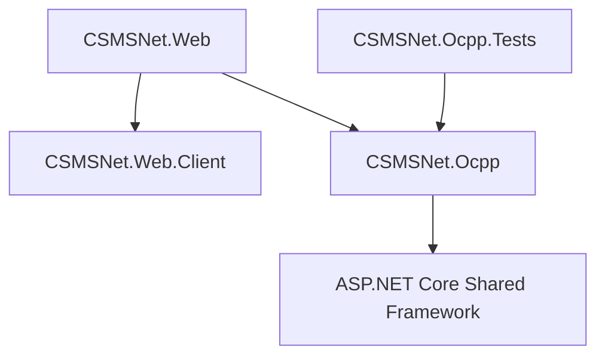

# CSMSNet OCPP 适配器项目手册

本文档旨在详细介绍 CSMSNet OCPP 适配器项目的代码结构、功能、依赖关系及使用方法，帮助开发者快速理解和集成该项目。

## 1. 项目简介

CSMSNet.Ocpp 是一个基于 .NET 10 开发的高性能 OCPP (Open Charge Point Protocol) 1.6 协议适配器。它作为充电站管理系统 (CSMS) 的接入层，负责处理充电桩与系统之间的通信，支持 WebSocket 连接、JSON 消息序列化/反序列化、协议验证及状态管理。

## 2. 代码结构与用途

解决方案 `CSMSNet.sln` 包含以下核心项目：

### 2.1. CSMSNet.Ocpp
**用途**: 核心类库，集成了协议处理、数据模型和服务器实现逻辑。
- **Abstractions/**: 定义核心接口，如 `IOcppAdapter` (主入口), `IOcppProtocolHandler` (协议处理), `IStateCache` (状态缓存)。
- **Models/**: 包含所有 OCPP 数据模型。
  - **V16/**: OCPP 1.6 版本的特定模型（Requests, Responses, Enums, Common Types）。
  - **Events/**: 定义各类事件参数（如 `BootNotificationEventArgs`, `StartTransactionEventArgs`）。
  - **State/**: 定义内部状态模型（如 `ChargePointState`）。
- **Configuration/**: 定义配置类 `OcppAdapterConfiguration`。
- **Exceptions/**: 定义自定义异常 `OcppException`。
- **Transport/**: WebSocket 通信层，包含 `ConnectionManager` 和 `OcppWebSocketMiddleware`。
- **Handlers/**: 消息处理逻辑，包含 `RequestHandler` 和 `MessageRouter`。

### 2.2. CSMSNet.Web
**用途**: 基于 ASP.NET Core 的 Web 主机项目，集成了 Blazor Server 和 WebAssembly (Interactive Auto 模式)。
- **CSMSNet.Web/**: 服务端主项目，负责服务注册、中间件配置以及服务器端渲染。
  - **Program.cs**: 应用入口。
  - **Components/**: Blazor 页面和组件。
- **CSMSNet.Web.Client/**: 客户端项目 (WASM)，负责在浏览器端运行的交互逻辑。
- 该项目作为 OCPP 服务器的宿主，同时也提供 Web 管理界面。

### 2.3. CSMSNet.Ocpp.Tests
**用途**: 单元测试项目，确保核心功能的正确性。

## 3. 关联依赖关系

项目间的依赖关系设计如下：



- **CSMSNet.Ocpp**: 核心库，不依赖具体的 Web 项目。
- **CSMSNet.Web**: 引用 Ocpp 库，将其作为服务集成到 Web 应用中。

## 4. 项目功能

### 4.1. 基础通信
- **WebSocket 服务器**: 支持 `/ocpp/{chargePointId}` 路径连接（通过 Web 项目配置）。
- **心跳机制**: 自动处理 WebSocket Ping/Pong 及 OCPP Heartbeat。
- **消息封装**: 支持 OCPP-J (JSON) 格式的 Call, CallResult, CallError 消息。

### 4.2. OCPP 1.6 核心功能
- **授权 (Authorize)**: 验证用户 RFID 卡或其他标识。
- **启动通知 (BootNotification)**: 处理充电桩上线握手。
- **状态通知 (StatusNotification)**: 实时更新充电桩和连接器状态。
- **事务管理 (Start/Stop Transaction)**: 处理充电会话的开始和结束。
- **电表数据 (MeterValues)**: 接收充电过程中的电压、电流、功率等采样数据。
- **远程控制**:
  - 远程启动/停止充电 (RemoteStart/StopTransaction)
  - 重置充电桩 (Reset)
  - 解锁连接器 (UnlockConnector)
  - 修改/获取配置 (Change/GetConfiguration)
  - 清除缓存 (ClearCache)
  - 数据传输 (DataTransfer)

### 4.3. 状态管理
- **实时状态缓存**: 内存中维护所有连接充电桩的状态、事务和配置信息。
- **在线监控**: 提供接口查询充电桩是否在线、获取所有在线列表。

## 5. 使用方法与示例代码

### 5.1. 在 ASP.NET Core 中集成

在 `Program.cs` 中注册服务并配置中间件：

```csharp
using CSMSNet.Ocpp;

var builder = WebApplication.CreateBuilder(args);

// 1. 注册 OCPP 适配器服务
// 将使用 appsettings.json 中的 "OcppAdapter" 节点配置
builder.Services.AddOcppAdapter(builder.Configuration);

var app = builder.Build();

// 2. 启用 WebSocket
app.UseWebSockets();

// 3. 映射 OCPP 端点
// 这将监听 ws://your-host/ocpp/{chargePointId}
app.Map("/ocpp", b => b.UseOcppAdapter());

app.Run();
```

**appsettings.json 配置示例**:

```json
{
  "OcppAdapter": {
    "HeartbeatInterval": "00:05:00",
    "BusinessEventTimeout": "00:00:30",
    "SessionInactivityTimeout": "00:30:00"
  }
}
```

### 5.2. 监听事件

适配器通过 C# 事件机制暴露充电桩的各种行为，您可以订阅这些事件来处理业务逻辑。通常建议创建一个 `HostedService` 来订阅这些事件。

```csharp
using CSMSNet.OcppAdapter.Abstractions;
using Microsoft.Extensions.Hosting;
using Microsoft.Extensions.Logging;

public class OcppEventHandler : IHostedService
{
    private readonly IOcppAdapter _adapter;
    private readonly ILogger<OcppEventHandler> _logger;

    public OcppEventHandler(IOcppAdapter adapter, ILogger<OcppEventHandler> logger)
    {
        _adapter = adapter;
        _logger = logger;
    }

    public Task StartAsync(CancellationToken cancellationToken)
    {
        // 监听充电桩连接
        _adapter.OnChargePointConnected += (sender, args) =>
        {
            _logger.LogInformation($"充电桩已连接: {args.ChargePointId}, 协议: {args.ProtocolVersion}");
        };

        // 监听 BootNotification (上线通知)
        _adapter.OnBootNotification += (sender, args) =>
        {
            _logger.LogInformation($"收到 BootNotification: {args.ChargePointId}");
            // 注意: 适配器会自动回复 Accepted，您主要在此处记录日志或更新数据库
        };

        return Task.CompletedTask;
    }

    public Task StopAsync(CancellationToken cancellationToken)
    {
        // 解除订阅逻辑（可选）
        return Task.CompletedTask;
    }
}
```

### 5.3. 查询状态

您可以随时查询充电桩的当前状态、连接器状态或活跃事务。

```csharp
string cpId = "CP001";

// 检查是否在线
if (adapter.IsChargePointOnline(cpId))
{
    // 获取充电桩状态
    var info = adapter.GetChargePointInfo(cpId);
    Console.WriteLine($"IP地址: {info?.ClientIp}, 连接时间: {info?.ConnectedAt}");

    // 获取连接器 1 的状态
    var status = adapter.GetConnectorStatus(cpId, 1);
    Console.WriteLine($"连接器 1 状态: {status?.Status}"); // 例如: Available, Preparing, Charging

    // 获取该连接器上的活跃事务
    var transaction = adapter.GetActiveTransaction(cpId, 1);
    if (transaction != null)
    {
        Console.WriteLine($"正在充电... 事务ID: {transaction.TransactionId}, 开始时间: {transaction.StartTime}");
    }
}
```

### 5.4. 下发控制指令

使用 `IOcppAdapter` 提供的方法向充电桩发送指令。所有指令都是异步的。

#### 远程启动充电 (RemoteStartTransaction)
```csharp
using CSMSNet.OcppAdapter.Models.V16.Requests;
using CSMSNet.OcppAdapter.Models.V16.Enums; // 用于 RemoteStartStopStatus

try 
{
    var request = new RemoteStartTransactionRequest
    {
        IdTag = "MY_RFID_CARD_123", // 授权用的卡号
        ConnectorId = 1             // 可选，指定连接器
    };

    var response = await adapter.RemoteStartTransactionAsync("CP001", request);
    
    if (response.Status == RemoteStartStopStatus.Accepted)
    {
        Console.WriteLine("远程启动指令已接受");
    }
    else
    {
        Console.WriteLine($"远程启动失败: {response.Status}");
    }
}
catch (Exception ex)
{
    Console.WriteLine($"发送指令异常: {ex.Message}");
}
```

#### 远程停止充电 (RemoteStopTransaction)
```csharp
using CSMSNet.OcppAdapter.Models.V16.Requests;

var request = new RemoteStopTransactionRequest
{
    TransactionId = 12345 // 必须是当前活跃的事务ID
};

var response = await adapter.RemoteStopTransactionAsync("CP001", request);
Console.WriteLine($"远程停止结果: {response.Status}");
```

#### 重置充电桩 (Reset)
```csharp
using CSMSNet.OcppAdapter.Models.V16.Requests;
using CSMSNet.OcppAdapter.Models.V16.Enums;

var request = new ResetRequest
{
    Type = ResetType.Soft // Soft (软件重启) 或 Hard (硬件重启)
};

var response = await adapter.ResetAsync("CP001", request);
Console.WriteLine($"重置指令结果: {response.Status}");
```

### 5.5. 增强的数据采集与状态缓存

本项目已增强了对充电桩上报数据的解析与缓存能力，支持以下丰富数据的实时访问：

- **电池状态 (BatteryStatus)**: 包含荷电状态 (SoC)、电压、电流、功率、温度等（需充电桩通过 MeterValues 上报）。
- **实时电气参数**: 连接器的实时电压、电流、功率快照。
- **充电桩配置**: 缓存充电桩的所有配置项（Configuration Items）。
- **固件与诊断状态**: 实时跟踪固件更新和诊断日志上传的进度。
- **本地鉴权列表版本**: 跟踪充电桩当前的 Local Auth List 版本。

访问示例：
```csharp
var connectorStatus = adapter.GetConnectorStatus("CP001", 1);
if (connectorStatus?.Battery != null)
{
    Console.WriteLine($"当前SoC: {connectorStatus.Battery.SoC}%, 电池电压: {connectorStatus.Battery.Voltage}V");
}

var cpStatus = adapter.GetChargePointStatus("CP001");
if (cpStatus != null)
{
    Console.WriteLine($"固件状态: {cpStatus.FirmwareStatus}");
    // 获取缓存的配置项
    if (cpStatus.ConfigurationItems.TryGetValue("HeartbeatInterval", out var interval))
    {
        Console.WriteLine($"心跳间隔: {interval}");
    }
}
```

### 5.6. 自动询问机制 (Auto-Interrogation)

系统内置了 `ChargePointInterrogator` 服务，实现了“即插即用”的数据同步体验：
1.  当充电桩上线并完成 BootNotification 握手后，系统自动触发询问流程。
2.  **自动获取配置**: 发送 `GetConfiguration` 获取充电桩所有配置参数并缓存。
3.  **自动同步版本**: 获取 `LocalAuthListVersion` 等状态信息。
4.  **配置同步**: 当通过 CSMS 修改配置 (`ChangeConfiguration`) 成功后，缓存会自动更新，无需重新查询。
