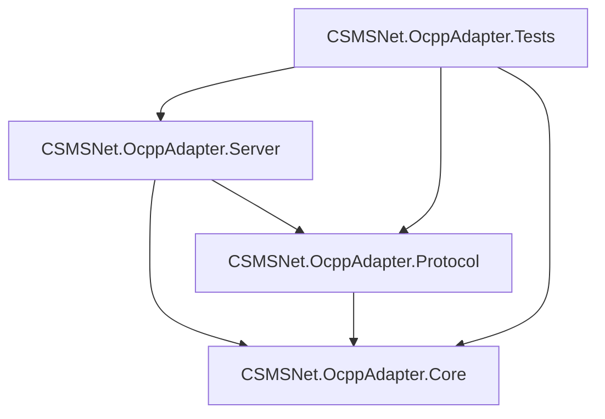

# CSMSNet OCPP 适配器项目手册

本文档旨在详细介绍 CSMSNet OCPP 适配器项目的代码结构、功能、依赖关系及使用方法，帮助开发者快速理解和集成该项目。

## 1. 项目简介

CSMSNet.OcppAdapter 是一个基于 .NET 9 开发的高性能 OCPP (Open Charge Point Protocol) 1.6 协议适配器。它作为充电站管理系统 (CSMS) 的接入层，负责处理充电桩与系统之间的通信，支持 WebSocket 连接、JSON 消息序列化/反序列化、协议验证及状态管理。

## 2. 代码结构与用途

解决方案 `CSMSNet.OcppAdapter.sln` 包含以下核心项目：

### 2.1. CSMSNet.OcppAdapter.Core
**用途**: 核心类库，定义了项目的基础架构、数据模型和抽象接口。
- **Abstractions/**: 定义核心接口，如 `IOcppAdapter` (主入口), `IOcppProtocolHandler` (协议处理), `IStateCache` (状态缓存)。
- **Models/**: 包含所有 OCPP 数据模型。
  - **V16/**: OCPP 1.6 版本的特定模型（Requests, Responses, Enums, Common Types）。
  - **Events/**: 定义各类事件参数（如 `BootNotificationEventArgs`, `StartTransactionEventArgs`）。
  - **State/**: 定义内部状态模型（如 `ChargePointState`, `Transaction`）。
- **Configuration/**: 定义配置类 `OcppAdapterConfiguration`。
- **Exceptions/**: 定义自定义异常 `OcppException`。

### 2.2. CSMSNet.OcppAdapter.Protocol
**用途**: 协议处理层，专注于 OCPP 消息的解析、验证和构建。
- **V16/Ocpp16ProtocolHandler.cs**: 实现 OCPP 1.6 协议的具体逻辑，处理 JSON 序列化、消息类型映射和验证。
- **V16/Ocpp16Constants.cs**: 定义协议相关的常量。

### 2.3. CSMSNet.OcppAdapter.Server
**用途**: 服务器实现层，负责网络通信和业务逻辑路由。
- **OcppAdapter.cs**: 适配器的主要实现类，协调网络层、协议层和状态缓存。
- **Transport/**: WebSocket 服务器实现，处理连接管理 (`ConnectionManager`) 和消息收发。
- **Handlers/**: 消息路由和处理器 (`MessageRouter`, `RequestHandler`)，将接收到的 OCPP 请求分发到对应的处理逻辑。
- **State/**: 状态缓存实现 (`StateCache`)，维护充电桩的实时状态。

### 2.4. CSMSNet.OcppAdapter.Tests
**用途**: 单元测试项目，确保核心功能的正确性。

## 3. 关联依赖关系

项目间的依赖关系设计遵循整洁架构原则，从内向外依赖：



- **Core**: 不依赖其他项目，仅依赖基础 .NET 库。
- **Protocol**: 依赖 Core，实现其中定义的协议接口。
- **Server**: 依赖 Core 和 Protocol，组装并运行服务。

## 4. 项目功能

### 4.1. 基础通信
- **WebSocket 服务器**: 支持 `/ocpp/{chargePointId}` 路径连接。
- **心跳机制**: 自动处理 WebSocket Ping/Pong 及 OCPP Heartbeat。
- **消息封装**: 支持 OCPP-J (JSON) 格式的 Call, CallResult, CallError 消息。

### 4.2. OCPP 1.6 核心功能
- **授权 (Authorize)**: 验证用户 RFID 卡或其他标识。
- **启动通知 (BootNotification)**: 处理充电桩上线握手。
- **状态通知 (StatusNotification)**: 实时更新充电桩和连接器状态。
- **事务管理 (Start/Stop Transaction)**: 处理充电会话的开始和结束。
- **电表数据 (MeterValues)**: 接收充电过程中的电压、电流、功率等采样数据。
- **远程控制**:
  - 远程启动/停止充电 (RemoteStart/StopTransaction)
  - 重置充电桩 (Reset)
  - 解锁连接器 (UnlockConnector)
  - 修改/获取配置 (Change/GetConfiguration)
  - 清除缓存 (ClearCache)
  - 数据传输 (DataTransfer)

### 4.3. 状态管理
- **实时状态缓存**: 内存中维护所有连接充电桩的状态、事务和配置信息。
- **在线监控**: 提供接口查询充电桩是否在线、获取所有在线列表。

## 5. 使用方法与示例代码

### 5.1. 初始化与启动服务

首先，创建配置并实例化 `OcppAdapter`，然后启动服务。

```csharp
using CSMSNet.OcppAdapter.Server;
using CSMSNet.OcppAdapter.Configuration;
using Microsoft.Extensions.Logging;

// 1. 创建配置
var config = new OcppAdapterConfiguration
{
    ListenUrl = "http://+:8080/",       // 监听地址和端口
    HeartbeatInterval = TimeSpan.FromMinutes(5),
    BusinessEventTimeout = TimeSpan.FromSeconds(30),
    IgnoreCertificateErrors = true      // 开发环境可开启
};

// 2. 创建 Logger (可选，实际项目中推荐使用依赖注入)
ILoggerFactory loggerFactory = LoggerFactory.Create(builder => builder.AddConsole());
ILogger<OcppAdapter> logger = loggerFactory.CreateLogger<OcppAdapter>();

// 3. 实例化适配器
var adapter = new OcppAdapter(config, loggerFactory);

// 4. 启动服务
await adapter.StartAsync();
Console.WriteLine("OCPP Server started on ws://localhost:8080/ocpp/{chargePointId}");

// ... 保持程序运行 ...
// await adapter.StopAsync(); // 停止服务
```

### 5.2. 监听事件

适配器通过 C# 事件机制暴露充电桩的各种行为，您可以订阅这些事件来处理业务逻辑。

```csharp
// 监听充电桩连接
adapter.OnChargePointConnected += (sender, args) =>
{
    Console.WriteLine($"充电桩已连接: {args.ChargePointId}, 协议: {args.ProtocolVersion}");
};

// 监听 BootNotification (上线通知)
adapter.OnBootNotification += (sender, args) =>
{
    Console.WriteLine($"收到 BootNotification: {args.ChargePointId}");
    Console.WriteLine($"厂商: {args.Request.ChargePointVendor}, 型号: {args.Request.ChargePointModel}");
    
    // 注意: 适配器会自动回复 Accepted，您主要在此处记录日志或更新数据库
};

// 监听 StartTransaction (开始充电)
adapter.OnStartTransaction += (sender, args) =>
{
    Console.WriteLine($"充电开始: {args.ChargePointId}, 事务ID: {args.TransactionId}");
    Console.WriteLine($"卡号: {args.Request.IdTag}, 连接器: {args.Request.ConnectorId}");
};

// 监听 MeterValues (电表数据)
adapter.OnMeterValues += (sender, args) =>
{
    Console.WriteLine($"收到电表数据: {args.ChargePointId}, 事务ID: {args.Request.TransactionId}");
    foreach(var meterValue in args.Request.MeterValue)
    {
        foreach(var sampledValue in meterValue.SampledValue)
        {
            Console.WriteLine($"  {sampledValue.Measurand ?? "Energy.Active.Import.Register"}: {sampledValue.Value} {sampledValue.Unit}");
        }
    }
};
```

### 5.3. 查询状态

您可以随时查询充电桩的当前状态、连接器状态或活跃事务。

```csharp
string cpId = "CP001";

// 检查是否在线
if (adapter.IsChargePointOnline(cpId))
{
    // 获取充电桩状态
    var info = adapter.GetChargePointInfo(cpId);
    Console.WriteLine($"IP地址: {info?.ClientIp}, 连接时间: {info?.ConnectedAt}");

    // 获取连接器 1 的状态
    var status = adapter.GetConnectorStatus(cpId, 1);
    Console.WriteLine($"连接器 1 状态: {status?.Status}"); // 例如: Available, Preparing, Charging

    // 获取该连接器上的活跃事务
    var transaction = adapter.GetActiveTransaction(cpId, 1);
    if (transaction != null)
    {
        Console.WriteLine($"正在充电... 事务ID: {transaction.TransactionId}, 开始时间: {transaction.StartTime}");
    }
}
```

### 5.4. 下发控制指令

使用 `IOcppAdapter` 提供的方法向充电桩发送指令。所有指令都是异步的。

#### 远程启动充电 (RemoteStartTransaction)
```csharp
using CSMSNet.OcppAdapter.Models.V16.Requests;

try 
{
    var request = new RemoteStartTransactionRequest
    {
        IdTag = "MY_RFID_CARD_123", // 授权用的卡号
        ConnectorId = 1             // 可选，指定连接器
    };

    var response = await adapter.RemoteStartTransactionAsync("CP001", request);
    
    if (response.Status == RemoteStartStopStatus.Accepted)
    {
        Console.WriteLine("远程启动指令已接受");
    }
    else
    {
        Console.WriteLine($"远程启动失败: {response.Status}");
    }
}
catch (Exception ex)
{
    Console.WriteLine($"发送指令异常: {ex.Message}");
}
```

#### 远程停止充电 (RemoteStopTransaction)
```csharp
using CSMSNet.OcppAdapter.Models.V16.Requests;

var request = new RemoteStopTransactionRequest
{
    TransactionId = 12345 // 必须是当前活跃的事务ID
};

var response = await adapter.RemoteStopTransactionAsync("CP001", request);
Console.WriteLine($"远程停止结果: {response.Status}");
```

#### 重置充电桩 (Reset)
```csharp
using CSMSNet.OcppAdapter.Models.V16.Requests;
using CSMSNet.OcppAdapter.Models.V16.Enums;

var request = new ResetRequest
{
    Type = ResetType.Soft // Soft (软件重启) 或 Hard (硬件重启)
};

var response = await adapter.ResetAsync("CP001", request);
Console.WriteLine($"重置指令结果: {response.Status}");
```

#### 解锁连接器 (UnlockConnector)
```csharp
using CSMSNet.OcppAdapter.Models.V16.Requests;

var request = new UnlockConnectorRequest
{
    ConnectorId = 1
};

var response = await adapter.UnlockConnectorAsync("CP001", request);
Console.WriteLine($"解锁结果: {response.Status}"); // Accepted, Rejected, UnlockFailed 等
```

#### 修改配置 (ChangeConfiguration)
```csharp
using CSMSNet.OcppAdapter.Models.V16.Requests;

// 例如：修改心跳间隔为 600 秒
var request = new ChangeConfigurationRequest
{
    Key = "HeartbeatInterval",
    Value = "600"
};

var response = await adapter.ChangeConfigurationAsync("CP001", request);
Console.WriteLine($"配置修改结果: {response.Status}"); // Accepted, Rejected, RebootRequired, NotSupported
```

#### 获取配置 (GetConfiguration)
```csharp
using CSMSNet.OcppAdapter.Models.V16.Requests;

var request = new GetConfigurationRequest
{
    Key = new[] { "HeartbeatInterval", "MeterValueSampleInterval" } // 要查询的键列表
};

var response = await adapter.GetConfigurationAsync("CP001", request);
if (response.ConfigurationKey != null)
{
    foreach (var configItem in response.ConfigurationKey)
    {
        Console.WriteLine($"{configItem.Key}: {configItem.Value} (只读: {configItem.Readonly})");
    }
}
```
